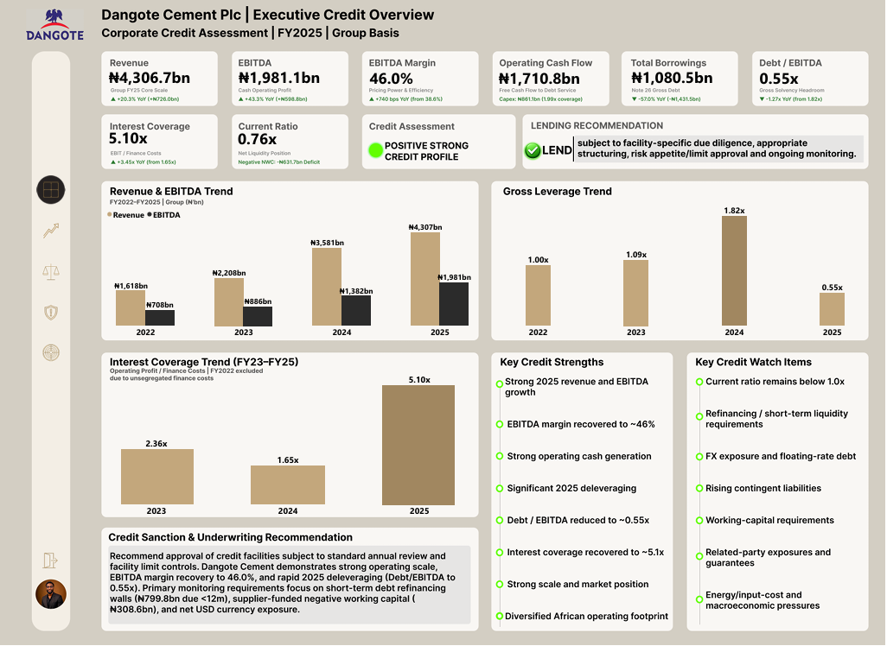

# Dangote Cement Plc — Enterprise Credit Risk Assessment

> **Corporate Credit Committee-style assessment | FY2022–FY2025 | Group basis**

## At a glance

This portfolio project simulates a corporate-bank credit assessment of **Dangote Cement Plc**, using audited public financial information for FY2022–FY2025. It combines financial analysis, repayment-capacity assessment, downside sensitivity testing, risk identification and a five-page Power BI monitoring dashboard to reach a structured preliminary lending view.

**Core question:** Can the borrower sustainably generate sufficient cash to service debt, and what could weaken that capacity?



### FY2025 credit snapshot

| Metric | FY2025 |
|---|---:|
| Revenue | ₦4,306.7bn |
| EBITDA | ₦1,981.3bn |
| Operating Profit | ₦1,765.3bn |
| Operating Cash Flow | ₦1,710.8bn |
| Total Borrowings | ₦1,080.5bn |
| Debt / EBITDA | 0.55x |
| Net Debt / EBITDA | ~0.34x |
| Interest Coverage | 5.10x |
| Current Ratio | 0.76x |
| Cash & Equivalents | ₦397.6bn |
| USD-Denominated Liabilities | ₦516.1bn |
| Group Contingent Liabilities | ₦457.4bn |

## Final credit view

### **POSITIVE / STRONG CREDIT PROFILE, SUBJECT TO STRUCTURE AND MONITORING**

**Preliminary lending recommendation: LEND — subject to facility-specific due diligence, appropriate structuring, risk appetite/limit approval and ongoing monitoring.**

The FY2025 position reflects substantial improvement versus FY2024: stronger earnings and operating cash generation, significant deleveraging, and a recovery in interest coverage. Key monitoring risks remain the sub-1x current ratio, short-term refinancing requirements, residual FX exposure, floating-rate sensitivity, rising contingent liabilities and the need to distinguish recurring operating cash capacity from non-recurring related-party support.

## Skills demonstrated

**Corporate credit analysis • Financial statement analysis • Debt & leverage analysis • Liquidity assessment • Cash-flow analysis • Stress testing • FX / interest-rate risk • Power BI • DAX • Excel • Credit monitoring**

## What the project demonstrates

- Corporate financial statement analysis
- Credit-risk assessment and repayment-capacity analysis
- Debt and leverage assessment
- Liquidity and working-capital analysis
- FX and interest-rate risk assessment
- Contingent-liability and related-party analysis
- Downside sensitivity / stress testing
- Credit Committee-style lending recommendation
- Power BI executive risk reporting and monitoring
- Evidence-based documentation and source governance

## Assessment framework

1. Borrower and group structure
2. Business and industry risk
3. Ownership and governance
4. Financial performance and earnings quality
5. Cash generation and cash conversion
6. Debt structure and leverage
7. Debt-service and repayment capacity
8. Liquidity and working capital
9. FX and interest-rate exposure
10. Contingent liabilities and related-party exposure
11. Downside sensitivity testing
12. Credit risks and mitigating factors
13. Lending structure and conditions
14. Post-approval monitoring
15. Final credit recommendation

## Power BI dashboard

The dashboard contains five final monitoring pages:

1. **Executive Credit Overview**
2. **Financial Performance & Cash Generation**
3. **Debt, Leverage & Repayment Capacity**
4. **Liquidity, FX & Contingent Risk**
5. **Early Warning & Credit Monitoring**

See [`02_PowerBI_Dashboard/Dashboard_Guide.md`](02_Dashboard/Dashboard_Guide.md) and the page screenshots in that folder.

## Repository structure

```text
Dangote_Cement_Enterprise_Credit_Risk_Assessment/
├── README.md
├── 01_Credit_Assessment/
│   └── Dangote_Cement_Final_Credit_Assessment.docx
├── 02_PowerBI_Dashboard/
│   ├── Dashboard_Guide.md
│   └── 5 final dashboard screenshots
├── 03_Data/
│   ├── Dangote_Cement_Credit_Analysis_Dataset.xlsx
│   └── Data_Dictionary.md
├── 04_Methodology_and_Analysis/
│   ├── Methodology.md
│   ├── Final_Analysis_Summary.md
│   └── Limitations.md
└── 05_Source_Documentation/
    ├── Source_Register.md
    └── Source_Evidence_Review.md
```

## Data and evidence discipline

The analysis is based primarily on publicly available audited annual reports for FY2022–FY2025 and a validated project dataset. The evidence review records whether information was directly disclosed, derivable, unavailable/not disclosed, or dependent on an external source. Missing information was not silently invented or zero-filled.

The project also distinguishes between current-year operating repayment capacity and non-recurring related-party support when interpreting the FY2025 deleveraging outcome.

## Important limitations

This is a **portfolio-based credit-risk case study**, not an actual facility approval, investment recommendation or commitment to lend. It does not incorporate private management information, a live borrower facility request, confidential covenant schedules, lender-specific security valuations or other non-public due-diligence materials.

See [`04_Methodology_and_Analysis/Limitations.md`](04_Methodology_and_Analysis/Limitations.md) for the full limitation and due-diligence list.

## Author

**Chegwe Favour**

Financial Data Analyst | Credit Risk & Loan Portfolio Analysis | SQL • Power BI • Excel
